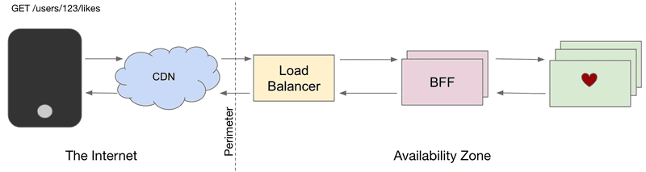

 
# Sound Cloud

## Introdução

 
As aplicações da SoundCloud reutilizam sua API pública; o uso de uma camada de serviços RESTful parecia uma decisão sólida, mas cada cliente tem suas próprias
necessidades. A SoundCloud está migrando para um modelo onde clientes mantêm suas próprias APIs. Foram necessárias mudanças em arquitetura, tecnologias e processo. Nesta
apresentação vamos explorar os desafios enfrentados e decisões tomadas. 

O presente trabalho buscará demonstrar a evolução da arquitetura de serviços na SoundCloud nos últimos anos, bem como abordará os desafios que foram encontrados e as
soluções adotadas. Em específico, será abordo a arquitetura Backends for Frontends (BFF), descrevendo seus prós e contras e os principais tópicos relacionados a essa
abordagem.

## Backends for Frontends
 

  <h3><b>Backends for Frontends no SoundCloud em 2021</b>  </h3> 
    
 <b>Figura 1. Arquitetura BFF. </b>  

 

 

A SoundCloud pioneirou o padrão arquitetônico Backends for Frontends em 2013, enquanto se afastava de um modelo datado de abordagem eat-your-own-dog-food que envolvia
o uso de uma única API (a API pública) tanto para aplicativos oficiais quanto para integrações de terceiros, porém a necessidade de escalar operacional e
organizacionalmente levou a uma migração de uma arquitetura baseada em monólito para uma arquitetura de microsserviços. A proliferação de novos microsserviços, aliada
à introdução de uma API privada/interna para o monólito (transformando efetivamente o monólito em outro microsserviço), abriu a porta para novas e inovadoras APIs
dedicadas para alimentar nossas interfaces, nascendo assim a BFF, sendo um momento emocionante para a empresa, pois permitiu autonomia para equipes, juntamente com
muitas outras vantagens que serão discutidas em breve. Em resumo, a BFF é um padrão arquitetônico que envolve a criação de múltiplos gateways de API dedicados para cada dispositivo ou tipo de interface, com o objetivo de otimizar cada API para o seu caso de uso particular.
  
A SoundCloud opera dezenas de BFFs, cada um alimentando uma API dedicada. Os BFFs fornecem responsabilidades de gateway de API, incluindo controle de taxa,
autenticação, saneamento de cabeçalho e controle de cache. Todo o tráfego externo que entra em nossos data centers é processado por um de nossos BFFs. Em conjunto,
eles lidam com centenas de milhões de solicitações por hora.

## O bom

Uma das principais vantagens que a BFF fornece é a autonomia. Ao ter APIs separadas por tipo de cliente, podemos otimizar nossas APIs para o que for conveniente para
cada tipo de cliente, sem a necessidade de pontos de sincronização e compromissos difíceis. Outra vantagem dos BFFs é a resiliência. Um deploy ruim pode derrubar um
único BFF em uma zona de disponibilidade, mas não deve derrubar toda a plataforma. Isso é adicionado a muitos outros mecanismos de resiliência em vigor. Além disso,
alta autonomia e menor risco levam a um alto ritmo de desenvolvimento. Nossos principais BFFs são implantados várias vezes por dia e recebem contribuições de toda a
organização de engenharia.

 

## O ruim

BFFs (Backends for Frontends) têm muitas vantagens, mas também podem causar problemas se não estiverem integrados a uma arquitetura de serviço mais ampla e em arquiteturas de serviço com microserviços muito pequenos, a integração de recursos tende a acabar nos próprios BFFs, se tornando crítico para regras de autorização que só podem ser aplicadas no momento da integração, tornando o modelo inadequado com a adição de mais BFFs.
  
Na SoundCloud, o problema se manifestou quando as entidades centrais Track e Playlist foram decompostas em múltiplos microserviços que atendiam partes das 
representações finais montadas em cada um dos BFFs. De repente, a lógica de autorização precisou ser movida para o ponto de integração, que, na época, era o BFF, não 
sendo preocupante no início, mas à medida que a lógica cresceu em complexidade e o número de BFFs aumentou, causou muitos problemas. 
 

 
 
 ## O feio
 
 
 

 Para operar vários BFFs de forma eficaz, é necessário um conjunto de capacidades em toda a plataforma que, em sua ausência, podem levar à proliferação desnecessária
 de BFFs. Isso inclui a necessidade de direitos de aplicativo para restringir o acesso a determinados aplicativos e integrações de terceiros a pontos de extremidade
 específicos. É importante estabelecer uma estratégia para decidir quantos BFFs são muitos e quando criar um versus quando reutilizar um existente, levando em
 consideração a troca entre autonomia e manutenção adicional e sobrecarga operacional.
  
Também é importante reconhecer que os BFFs estão na interseção de dois mundos, e a ideia de plena autonomia para os desenvolvedores do cliente é uma ilusão, sendo
necessária uma extensa colaboração entre engenheiros de front-end e back-end para garantir designs de API otimizados que sejam convenientes para os desenvolvedores do
cliente usar, além de serem otimizados para ambientes distribuídos e suas complexidades. É preciso ter cuidado ao empurrar a lógica complexa do lado do cliente para o
BFF, pois isso pode levar a problemas como timeouts, limites restritivos para o tamanho da coleção e tempestades que podem derrubar todo o sistema.

